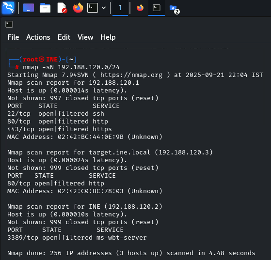
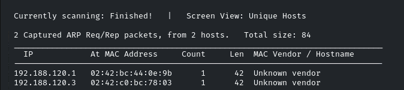
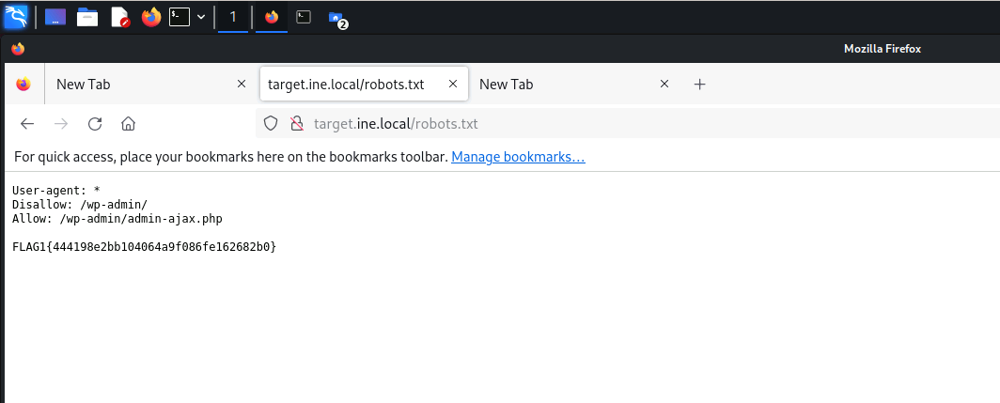
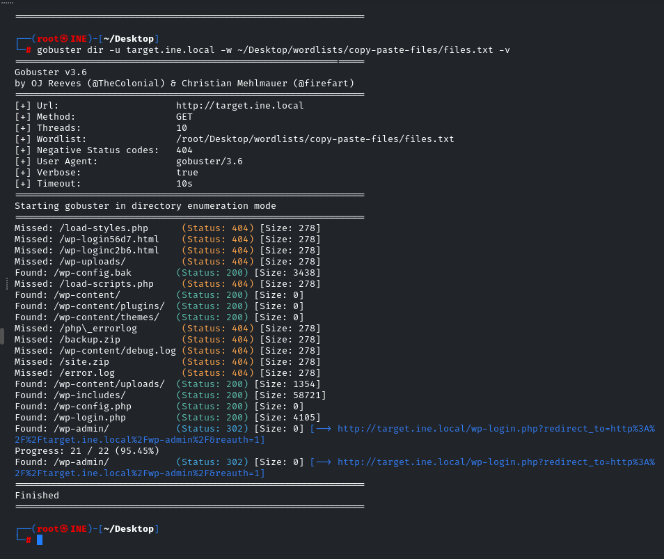
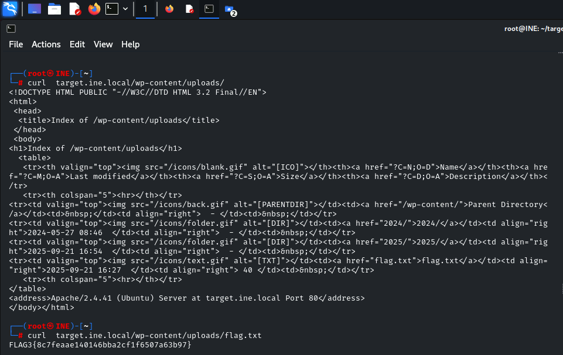
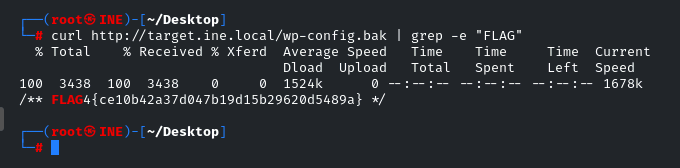
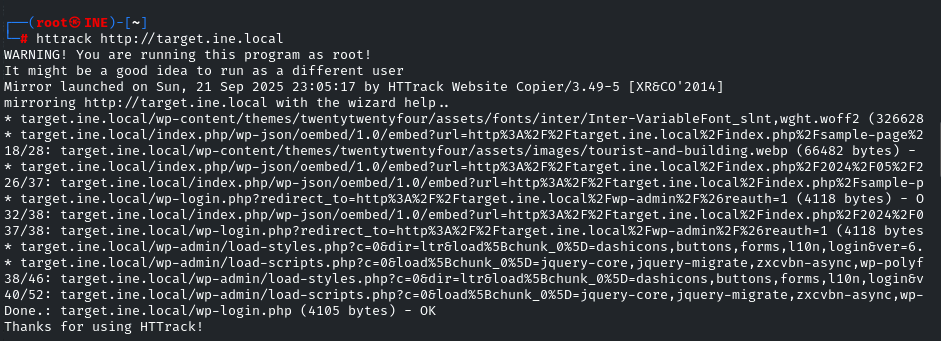
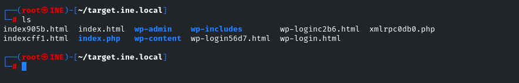
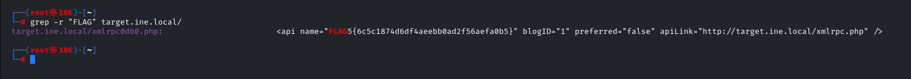

# **Info Gathering & Recon LAB – Full Documentation**

This is my raw, step-by-step lab journal for capturing all **5 flags**. I documented my terminal outputs, thought process, mistakes, learnings.

Screenshots are referenced in the doc — just put them in `images/` folder with the same names.

---

## **Target Info**

* Our IP: `192.188.120.2/24`
* Target IP: `192.188.120.3`
* Domain: `target.ine.local`

---

## **Tools Used**

* Firefox
* curl
* httrack
* nmap
* netdiscover
* gobuster

---

## **Step 1: Host Discovery**

### **1a) Find our IP and subnet**

```bash
ip a s
```

Output:

```
inet 192.188.120.2/24
```

**Learning:** Found my IP & subnet.

---

### **1b) Scan for online hosts**

#### **nmap**

```bash
nmap -sN 192.188.120.0/24
```

Output highlights:

* Router: `192.188.120.1`
* Target: `192.188.120.3` (HTTP open)
* Our host: `192.188.120.2`



#### **netdiscover**

```bash
netdiscover -i eth1
```

Output highlights:

* Found router & target via ARP
  **Learning:** ARP packet mapping MAC ↔ IP.



---

## **Step 2: Identify Website & Version (FLAG2)**

```bash
whatweb target.ine.local
```

Output:

```
Apache[2.4.41], WordPress[6.5.3 - FLAG2{c1143664e8a046fcb67ae2e5e8d72fc1}]
```

* **FLAG2 captured!**


**Learning:** Outdated WP version → potential attack surface.

---

## **Step 3: Robots.txt (FLAG1)**

Access `http://target.ine.local/robots.txt`

```
User-agent: *
Disallow: /wp-admin/
Allow: /wp-admin/admin-ajax.php
```

* **FLAG1:** `FLAG1{444198e2bb104064a9f086fe162682b0}`



---

## **Step 4: Directory Enumeration (FLAG3)**

Used **Gobuster** for first time:

```bash
gobuster dir -u target.ine.local -w ~/Desktop/wordlists/copy-paste-files/files.txt -v
```

* Found `/wp-content/uploads/`

```bash
curl target.ine.local/wp-content/uploads/flag.txt
```

* **FLAG3:** `FLAG3{8c7feaae140146bba2cf1f6507a63b97}`




---

## **Step 5: Backup File (FLAG4)**

* Found via Gobuster: `/wp-config.bak`

```bash
curl target.ine.local/wp-config.bak | grep -e "FLAG"
```

* **FLAG4:** `FLAG4{ce10b42a37d047b19d15b29620d5489a}`



---

## **Step 6: Mirroring & Searching (FLAG5)**

Mirror the website using **httrack**:

```bash
httrack http://target.ine.local
```

Search mirrored files for FLAG:

```bash
grep -r "FLAG" ~/target.ine.local/
```

* **FLAG5:** `FLAG5{6c5c1874d6df4aeebb0ad2f56aefa0b5}`





**Learning:** Local grep search on mirrored site is a lifesaver!

---

## **Summary of All Flags**

| Flag  | Value                              |
| ----- | ---------------------------------- |
| FLAG1 | `444198e2bb104064a9f086fe162682b0` |
| FLAG2 | `c1143664e8a046fcb67ae2e5e8d72fc1` |
| FLAG3 | `8c7feaae140146bba2cf1f6507a63b97` |
| FLAG4 | `ce10b42a37d047b19d15b29620d5489a` |
| FLAG5 | `6c5c1874d6df4aeebb0ad2f56aefa0b5` |

---

## **Key Learnings**

* ARP vs Nmap host discovery.
* WhatWeb for website fingerprinting → check versions & meta.
* Gobuster first-time experience → directory enumeration rocks.
* Robots.txt can leak sensitive paths
* Backup files & mirrored sites = hidden gold.

found all flags"which suprised me too" step by step, learned a ton, and documented my mistakes 😎.

---

If you want, I can also **write the `README.md` for this RECON\_LAB folder** so it looks clean on GitHub with the folder structure, images, and a short overview.

Do you want me to do that next?

