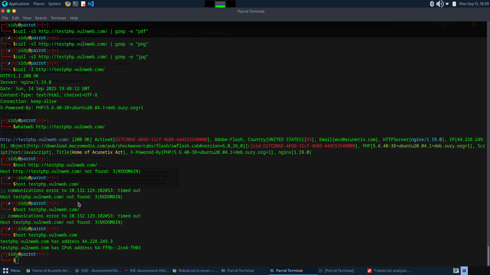

# Passive Recon — testphp.vulnweb.com
**Date:** 2025-09-14  
**Target:** http://testphp.vulnweb.com (legal practice site)

## 1. Target & IPs
- Domain: testphp.vulnweb.com  
- IPv4: 44.228.249.3  
- IPv6: 64:ff9b::2ce4:f903

## 2. HTTP Headers (evidence)
Server: nginx/1.19.0  
Content-Type: text/html; charset=UTF-8  
Connection: keep-alive  
X-Powered-By: PHP/5.6.40-38+ubuntu20.04.1+deb.sury.org+1  

## 3. Tech fingerprint (WhatWeb / WhatRuns)
- nginx/1.19.0, PHP 5.6.40, Adobe Flash, ActiveX, JavaScript present

## 4. Robots / Sitemap
- robots.txt -> 404 Not Found  
- sitemap.xml -> 404 Not Found  
(Observation: site lacks robots/sitemap — typical for testbed)

## 5. Visible pages & links
- index.php (home)  
- categories.php  
- artists.php  
- guestbook.php  
- AJAX/index.php (AJAX demo)  
- login.php (signup/login)  
(Top 3 high-value: AJAX demo, guestbook, cart)

## 6. Forms & inputs
- login.php | auth | inputs: username, password  
- signup.php | account creation | inputs: name, email, password

## 7. Page-source clues
- (paste the 3–5 page source lines you saved earlier)

## 8. Wayback / archives
- (paste any Wayback URLs you found or "none")

## 9. Risk summary & next passive steps
- Outdated PHP -> note as risk (do not exploit)  
- Deprecated Flash/ActiveX -> indicator of legacy content  
- Next passive steps: archive checks, resource harvesting, screenshotting

## 10. Screenshots
  

