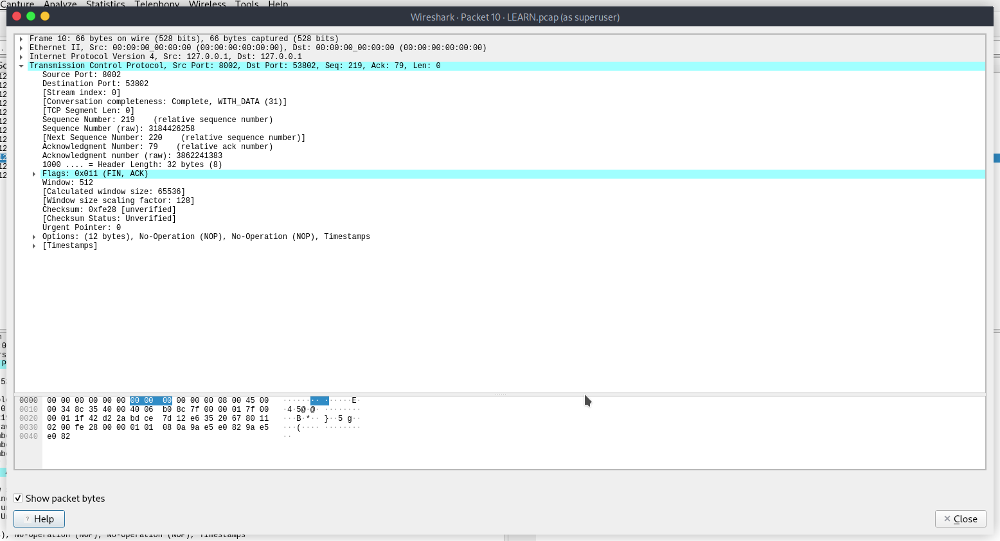

# TCP Handshake Lab – Deep Dive

**AIM:**
To capture a 3-way handshake and see what's inside it. Understand how the communication works, how layers interact, and how headers function.

---

## LAB SETUP

We will require:

1. Wireshark
2. Python
3. tcpdump

**Purpose of each tool:**

* **Wireshark:** Analyze the packets.
* **Python:** Start a server to which we will send requests and capture the 3-way handshake.
* **tcpdump:** Capture the packets on the way (will explain why Wireshark alone wasn’t used).

---

## Required Files

All files needed for this lab are available in the [`things_required`](things_required) folder:

| File                                                         | Description                           |
| ------------------------------------------------------------ | ------------------------------------- |
| [`LEARN.pcap`](things_required/LEARN.pcap)                   | The captured TCP handshake packets    |
| [`index.html`](things_required/index.html)                   | The simple HTTP page used in the lab  |
| [`tcp_commands.txt`](things_required/tcp_commands.txt)       | All terminal commands used in the lab |
| [`wireshark_setup.txt`](things_required/wireshark_setup.txt) | Wireshark configuration & notes       |

> **Note:** Place all files in `/things_required` in the repo root exactly as named.

---

## Starting the Python Server

We will create a folder and inside it an `index.html` containing:

```html
<h1>TCP HANDSHAKE Learning</h1>
```

It will be hosted on TCP port **8002** with IP `127.0.0.1`.

Commands (also saved in [`tcp_commands.txt`](things_required/tcp_commands.txt)):

```bash
mkdir python_ser
cd python_ser
gedit index.html
# (write the one line of code above)
python3 -m http.server 8002
```

Server is now running — everything is working fine.


---

## Capturing the Handshake

Use `tcpdump` to capture packets:

```bash
sudo tcpdump -i lo tcp port 8002 -w ~/python_ser/LEARN.pcap
```

Generate traffic with `curl`:

```bash
curl http://127.0.0.1:8002/
```

Packets are now captured. Next, we analyze them using Wireshark.


> You can also directly use the pre-captured [`LEARN.pcap`](things_required/LEARN.pcap) in Wireshark for analysis.

---

## Packet Analysis

**12 frames captured on loopback interface, TCP port 8002.**

---

### Packet 1

```
1   0.000000 127.0.0.1 -> 127.0.0.1 TCP 74 53802 → 8002 [SYN] Seq=0 Win=65495 Len=0 MSS=65495 SACK_PERM TSval=2598756481 TSecr=0 WS=128
```

* Seq number is 0, SYN set → first packet from client
* Client → Server: Port 53802 → 8002
* Localhost IP used (both client & server)
* This is the start of the handshake


---

### Packet 2

```
2   0.000016 127.0.0.1 -> 127.0.0.1 TCP 74 8002 → 53802 [SYN, ACK] Seq=0 Ack=1 Win=65483 Len=0 MSS=65495 SACK_PERM TSval=2598756481 TSecr=2598756481 WS=128
```

* Seq 0, Ack 1, SYN+ACK → server’s response
* Server → Client: Port 8002 → 53802
* Window size & ACK indicates server received the client’s SYN


---

### Packet 3

```
3   0.000024 127.0.0.1 -> 127.0.0.1 TCP 66 53802 → 8002 [ACK] Seq=1 Ack=1 Win=65536 Len=0 TSval=2598756481 TSecr=2598756481
```

* Client ACKs server’s SYN
* Seq = 1, Ack = 1
* Handshake complete after this packet


---

### Packet 4 – Data Starts

```
Frame 4: 144 bytes
TCP 53802 → 8002 Seq:1 Ack:1 Len:78
HTTP GET / HTTP/1.1
Host: 127.0.0.1:8002
```

* First actual data transmission from client
* Seq and Ack numbers used for tracking data flow


---

### Packet 5 – Server ACK

```
66 bytes on wire
TCP 8002 → 53802 Seq:1 Ack:79 Len:0
```

* Server acknowledges client’s data
* First data transmission acknowledgment


---

### Packet 6 – Server Data Push

```
251 bytes
TCP 8002 → 53802 Seq:1 Ack:79 Len:185 [PSH, ACK]
```

* PSH: Push data to application layer immediately
* Next Seq = 186
* Client will acknowledge this next


---

### Packet 7 – Client ACK

```
66 bytes
TCP 53802 → 8002 Seq:79 Ack:186 Len:0
```

* Client acknowledges server’s pushed data
* Next Seq = 79 → handshake of data continuing


---

### Packet 8 – Server Sends HTML Response

```
99 bytes
TCP 8002 → 53802 Seq:186 Ack:79 Len:33
HTTP/1.0 200 OK
<h1>TCP HANDSHAKE Learning</h1>
```

* Server sends requested index.html data
* Seq & Ack numbers track transmission progress


---

### Packet 9 – Client ACK

```
66 bytes
TCP 53802 → 8002 Seq:79 Ack:219 Len:0
```

* Client acknowledges reception of HTML response


---

### Packet 10 – Server FIN

```
66 bytes
TCP 8002 → 53802 [FIN, ACK] Seq=219 Ack=79
```

* Server initiates session termination



---

### Packet 11 – Client FIN

```
66 bytes
TCP 53802 → 8002 [FIN, ACK] Seq=79 Ack=220
```

* Client also terminates connection


---

### Packet 12 – Server ACK

```
66 bytes
TCP 8002 → 53802 [ACK] Seq=220 Ack=80
```

* Final acknowledgment, session ends


---

## Summary

* HTTP mode allowed seeing all packets and payload
* Sequence & acknowledgment numbers clearly link each step of the handshake and data transmission
* Next, we will explore HTTPS mode and bypass techniques

> You can also refer to the files:
>
> * [`LEARN.pcap`](things_required/LEARN.pcap)
> * [`index.html`](things_required/index.html)
> * [`tcp_commands.txt`](things_required/tcp_commands.txt)
> * [`wireshark_setup.txt`](things_required/wireshark_setup.txt)

---

**Note:** I am a student like you; if anything is wrong, feel free to correct me. Let’s learn together!

---


