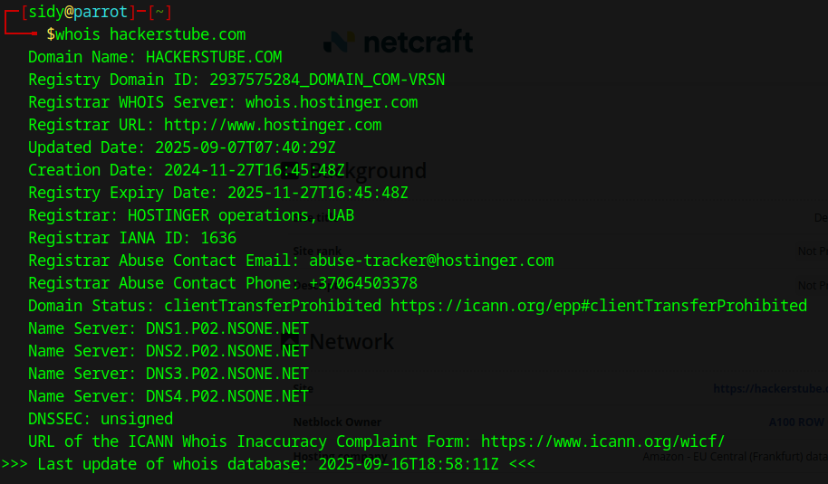
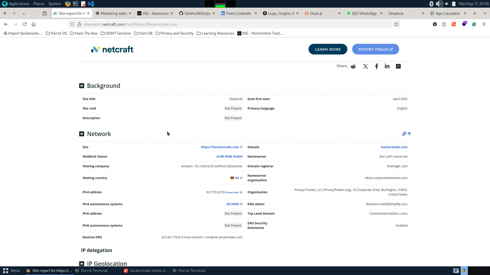
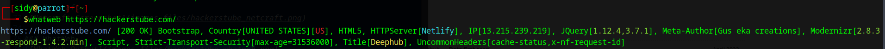

**TARGET:** `hackerstube.com`  
**RECON DATE (ISO):** `2025-09-17`  
**ANALYST:** `Siddhesh Yedge / @Siddhu580`  
**SCOPE:** `Passive recon only (whois, DNS, dig, whatweb, crt.sh, Wayback, etc.)`  
**TOOLS & VERSIONS:**

* `whois (version)`
* `dig (9.18.33)`
* `whatweb (version)`
* `other tools`  
Few extensions were also used by me:  
1) BuiltWith  
2) WhatRuns  
3) Wappalyzer  

---

## Executive summary

hackerstube.com is a static website where the CDS is Amazon Web Services - EC2. Through passive checks, most technologies appear up-to-date and the TLS certificates were valid at the time of analysis.  

---

## Quick facts

* **Registrar:** `HOSTINGER operations (IANA ID: 1636)`  
* **Registrant:** `<org / redacted>`  
* **Creation Date:** `2024-11-27`  
* **Updated Date:** `2025-09-07`  
* **Expiry Date:** `2025-11-27`  
* **Status flags:** `clientTransferProhibited`  
* **Registrar abuse contact:** `abuse-tracker@hostinger.com / +37064503378`  
* **DNSSEC:** `unsigned`  

---

## DNS & Mail records

* **Nameservers:** `dns1.p02.nsone.net. , dns2.p02.nsone.net. , dns3.p02.nsone.net. , dns4.p02.nsone.net.`  
* **A records:** `13.215.239.219 , 52.74.6.109`  
* **AAAA records:** `64:ff9b::344a:66d , 64:ff9b::dd7:efdb`  
* **CNAMEs:** `—`  
* **MX records:** `10 mx1.privateemail.com. , 10 mx2.privateemail.com.`  
* **TXT records:** `<SPF/DMARC/other TXT entries>`  

---

## Infrastructure & hosting inference

* **Public IP ownership (RIR):** `AMAZON`  
* **CDN / proxy evidence:** `Netlify — evidence: headers + hosting signature`  
* **Probable origin host:** `Netlify`  
* **TLS / Cert details (brief):** `Validity period — From Sep 7 2025 to Dec 6 2025 (2 months, 4 weeks)`  

---

## Risk / Analysis

* **Age & legitimacy:** `Established 2024-11-27 (currently ~11 months old). Expiry due soon (2025-11-27) → could indicate disposable risk if not renewed.`  
* **Top findings / red flags:**  
  1. TLS certificate expires in Dec 2025 (3 months validity remaining).  

---

## Evidence & Screenshots

### WHOIS

### Netcraft

### WhatWeb

---

## Legal / scope note

Passive reconnaissance only. Confirm authorization before any active scanning or further testing.  

---

## Analyst sign-off

**Name:** `Siddhesh Anil Yedge`  
**Contact:** `siddheshyedge@gmail.com / GitHub: Siddhu580`  
**Date:** `2025-09-17`  

